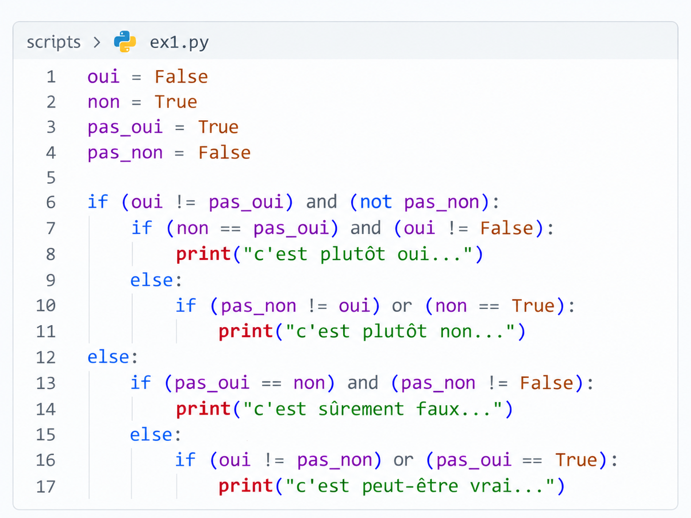

# Examen - Algorithmie - Bachelor 1

> **Durée : 2 h 30 - Barème : 20 points**
> 

# Consignes

- Vous travaillez sur votre machine et pouvez exécuter votre code Python autant que nécessaire, sauf lorsque l'énoncé précise explicitement le contraire.
- Le dépôt du cours **2627-algo-epsi-b1** est autorisé.
- Toute autre ressource Internet et tout outil d'IA sont interdits.
- Les exercices sont indépendants.
- Lorsque vous écrivez du code, privilégiez une solution claire et lisible.
- Si votre programme n'est pas entièrement fonctionnel, vous pouvez ajouter des commentaires pour montrer votre raisonnement : ils pourront être pris en compte dans la correction.

---

# Exercice 1 - VRAI ou FAUX - 3 points

Un développeur a fait n'importe quoi : il a codé l'algorithme ci-dessous sans respecter les règles de nommage des variables et en imbriquant des `if / else` sans éthique. Cela ressemble presque à du sabotage.

**Pour cet exercice uniquement, n'exécutez pas le code.**

Étudiez-le minutieusement et indiquez **exactement ce qu'il va afficher**.

Il peut ne rien afficher.



---

# Exercice 2 - Alerte dans des journaux - 3 points

> **Contexte :** un programme conserve le résultat de plusieurs opérations sous forme de textes. `"OK"` indique qu'une opération s'est bien terminée et `"ERROR"` qu'une erreur a été détectée.
> 

La fonction suivante doit renvoyer `True` dès qu'au moins une erreur est présente, et `False` sinon.

Elle contient un bug.

```python
def has_error(statuses):
    for status in statuses:
        if status == "ERROR":
            return True
        else:
            return False
```

Corrigez la fonction pour qu'elle respecte les résultats suivants :

```python
has_error(["OK", "OK", "ERROR", "OK"])   # True
has_error(["OK", "OK"])                  # False
has_error(["ERROR"])                     # True
has_error([])                            # False
```

---

# Exercice 3 - Alerte de température en chambre froide - 4 points

> **Contexte :** une chambre froide stocke des produits qui doivent rester entre **2,0 °C et 8,0 °C inclus**. Un capteur transmet ses mesures sous forme de texte. On suppose que toutes les valeurs reçues représentent bien un nombre.
> 

Écrivez une fonction :

```python
alert_temperatures(values, minimum, maximum)
```

qui renvoie **une nouvelle liste de nombres** contenant uniquement les températures situées **en dehors** de l'intervalle autorisé.

La liste reçue en argument ne doit pas être modifiée.

Exemple :

```python
measurements = ["4.2", "7.8", "10.1", "2.0", "-1.5", "8.0"]

alert_temperatures(measurements, 2.0, 8.0)
# [10.1, -1.5]
```

Vérifiez également le comportement de votre fonction avec :

```python
alert_temperatures(["1.9", "2.0", "8.0", "8.1"], 2.0, 8.0)
# [1.9, 8.1]
```

---

# Exercice 4 - Fonction et ADN - 5 points

> **Contexte :** l'ADN peut être représenté comme une chaîne composée des lettres `A`, `T`, `C` et `G`. Pour obtenir la séquence complémentaire, on applique les correspondances suivantes : **A devient T, T devient A, C devient G et G devient C**. Aucune autre connaissance en biologie n'est nécessaire.
> 

Créez une fonction :

```python
sequence_comp(sequence)
```

qui prend en argument une chaîne de caractères représentant une séquence ADN et qui **renvoie la séquence complémentaire associée**.

On suppose que les séquences reçues contiennent uniquement les quatre lettres `A`, `T`, `C` et `G`.

Exemple :

```python
sequence_comp("ATCG")   # "TAGC"
```

Dans le programme principal, parcourez la liste `seq` définie ci-dessous, appelez la fonction pour chaque séquence et affichez le résultat obtenu.

```python
# Extraits de séquences ADN.
seq = [
    "CCATTAGTTA",
    "ATTGCCTTGG",
    "CGCTTGAAAT",
]
```

---

# Exercice 5 - Robot dans une zone de stockage - 5 points

> **Contexte :** un petit robot se déplace dans une zone rectangulaire. Toutes les règles utiles sont précisées ci-dessous ; aucune connaissance en robotique n'est nécessaire.
> 

La zone possède une largeur `width` et une hauteur `height`.

Une position est représentée par une liste :

```python
[x, y]
```

avec :

- `x = 0` sur le bord gauche ;
- `y = 0` sur le bord bas ;
- une position est valide si `x >= 0` et `x < width`, et si `y >= 0` et `y < height`.

Chaque commande est une chaîne de **deux caractères** :

- `"N"` : monter ;
- `"S"` : descendre ;
- `"E"` : aller vers la droite ;
- `"O"` : aller vers la gauche ;
- le second caractère indique la distance à parcourir, comprise entre 1 et 9.

Exemples :

```
"N3" → monter de 3 cases
"O2" → aller de 2 cases vers la gauche
```

Une commande est appliquée uniquement si **la position d'arrivée reste dans la zone**. Sinon, la commande entière est ignorée et le robot reste à sa position précédente.

Écrivez une fonction :

```python
move_robot(position, command, width, height)
```

qui renvoie la position obtenue après une commande.

Utilisez ensuite `assert` pour vérifier que les deux appels suivants produisent les résultats attendus :

```python
move_robot([2, 2], "N2", 7, 6)   # [2, 4]
move_robot([6, 5], "E1", 7, 6)   # [6, 5]
```

Utilisez ensuite votre fonction pour appliquer successivement les commandes suivantes et affichez la position finale du robot :

```python
width = 7
height = 6

position = [2, 1]

commands = [
    "N3",
    "E4",
    "N2",
    "O1",
    "S4",
]
```